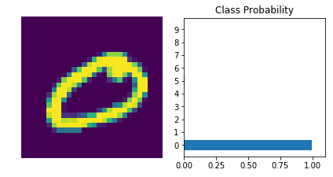

# MNIST-Handwritten-Digit-Recognition
Neural Network is training on infamous MNIST dataset which recognizes handwritten digits using Deep Learning. Implemented using Pytorch

# Problem Statement and Data Description

Each image is 28 pixels in height and 28 pixels in width, for a total of 784 pixels in total. Each pixel has a single pixel-value associated with it, indicating the lightness or darkness of that pixel, with higher numbers meaning darker. This pixel-value is an integer between 0 and 255, inclusive.

A very simple neural network implemented in python using Stochastic Gradient Descent and Backpropagation.

## Output 

